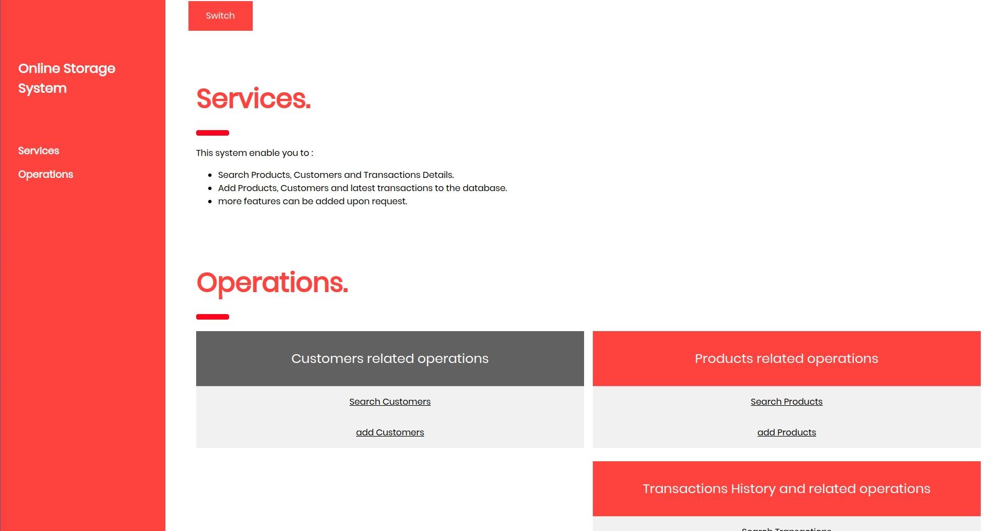

# oss-v1
online storage system
-
this repostory is made as part of object orinted design class, each update will include a new design pattern introduced in the class.

it's a flask click application - psotgresql DB will be used
How to Run:
- go to src directory
- open terminal 
- type python run-api  
screenshot: 

